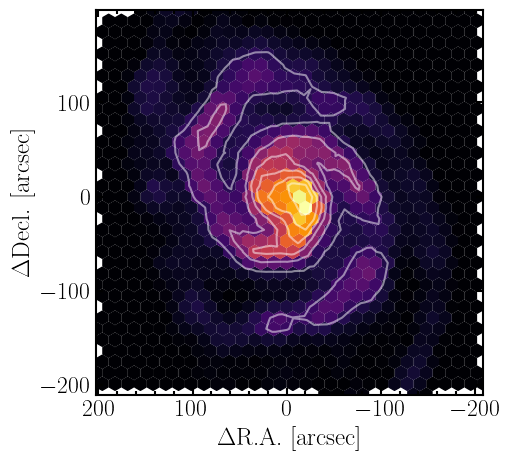

.. _Analysis:

Working with PyStructures
=========================

How to open the file
--------------------

When you run the ``create_database.py`` script (see :ref:`run_example`), it creates a
``.npy`` file, which simply contains a dictionary. To open this dicionary (for example in another ``Python`` scripts
or in Jupyter Notebook), you can simply run:

.. code-block::

  import numpy as np
  database = np.load("<path to npy file>", allow_pickle = True).item()

The instance ``database`` is now a ``Python`` dictionary, and the relevant, processed data can be extracted using this infrastructure.
For example ``database['rgal_kpc']`` returns an array containing the galacocentric distances of each point (in kpc).

The PyStructure class
---------------------
The download comes with a script that lets you handle the PyStructure output as a ``Python`` class.
This makes it easier to work and use with the databases.

To read in a database, you can use the following synthax:
.. code-block::

  import sys
  sys.path.append("<path to PyStructure/scritps folder")
  import PyStructure as ps

  database = ps.PyStructure("path_to_file.npy")

This way you have extracted the databse as a dictionary, and can access it (for example the galactocentric radii) using ``database.struct['rgal_kpc']``.

Quick Examples
--------------

Using the PyStructure class environment, some useful commands are:

* **List of lines (3D cubes) included in PyStructure**
.. code-block::

  print(database.lines)
  >>> ['12CO21', '12CO10']

* **Extract and plot spectrum (e.g. of brightest sightline)**
.. code-block::

  import matplotlib.pyplot as plt

  vaxis = database.get_vaxis()

  #extract the CO(1-0) integrated intensities
  ii_co10=database.struct['INT_VAL_12CO10']

  #find index of largest intensity (i.e. the brightest sightline)
  idx_brightes = np.argmax(ii_co10)

  spec_co10 = database.struct['SPEC_VAL_12CO10'][idx_brightes,:]

  #plot spectrum
  plt.figure()
  plt.step(vaxis, spec_co10)
  plt.show()

.. image:: spec.png
     :width: 600

* **Make 2D map of integrated intensities (quicklook)**

.. code-block::

  database.quickplot_2Dmap('12CO10')

.. image:: quicklook2.png
       :width: 400

This function makes it possible to have a quick look at the integrated intensity one of the cubes that are loaded in the PyStructure.

* **Make 2D map of integrated intensities (more extended)**

We can also produce the maps ourselves, such that we have some more advanced options
.. code-block::

  # Extract coordinates. We do not have to provide the center coordinate, this just
  # returns the coordinates relative to the reference coordinate.
  ra, dec = database.get_coordinates("13:29:52.7 47:11:43")

  ii_co10=database.struct['INT_VAL_12CO10']
  ii_co21=database.struct['INT_VAL_12CO21']

  plt.figure(figsize=(5,5))
  ax=plt.subplot(1,1,1)
  plt.scatter(ra, dec,c=ii_co10, s=90, marker='h', cmap='inferno')
  plt.tricontour(ra, dec,ii_co21, colors='w', alpha=.5)
  ax.invert_xaxis()
  ax.set_xlabel(r'$\Delta$R.A. [arcsec]')
  ax.set_ylabel(r'$\Delta$Decl. [arcsec]')
  plt.show()

